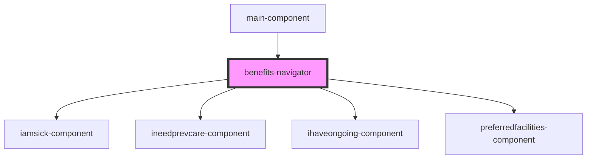

# benefits-navigator

<!-- Auto Generated Below -->

## Dependencies

### Used by

 - [main-component](../main-component)

### Depends on

- [iamsick-component](iamsick-component)
- [ineedprevcare-component](ineedprevcare-component)
- [ihaveongoing-component](ihaveongoing-component)
- [preferredfacilities-component](preferredfacilities-component)

### Graph

----------------------------------------------

*Built with [StencilJS](https://stenciljs.com/)*
