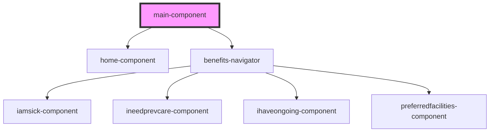

# main-component

<!-- Auto Generated Below -->

## Dependencies

### Depends on

- [home-component](../home-component)
- [benefits-navigator](../benefits-navigator)

### Graph

----------------------------------------------

*Built with [StencilJS](https://stenciljs.com/)*
